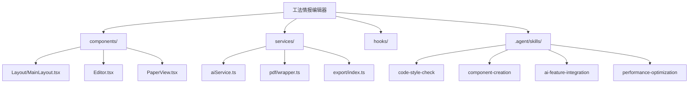

<div align="center">

</div>

# SWS 工法情报系统 - 本地运行与部署

这是一个基于 React + TypeScript 的工法情报编辑和管理系统，支持极其精细的富文本编辑、PDF 解析、智能 AI 辅助以及杂志级排版导出。

在 AI Studio 中查看应用: https://ai.studio/apps/drive/139L7v7pTpQDqBY8nzmA_5yAFOrZDtRwe

## 🚀 快速开始 (Quick Start)

**前提条件:** Node.js

1. **安装依赖**:
   ```bash
   npm install
   ```

2. **配置环境**:
   在 `.env.local` 中设置 `GEMINI_API_KEY` 为您的 Gemini API 密钥。

3. **运行应用**:
   ```bash
   npm run dev
   ```

4. **构建生产版本**:
   ```bash
   npm run build
   ```

---

## 📂 项目结构 (Project Structure)

本项目的目录结构经过模块化重构，以下是核心架构说明：



### 关键文件说明

- **核心组件**:
  - `src/components/Layout/MainLayout.tsx`: 应用主布局容器，管理侧边栏与内容区。
  - `components/Editor.tsx`: 核心编辑器，支持 AI 拟题、媒体原子化插入。
  - `components/PaperView.tsx`: 两态渲染引擎（杂志风/原版风格）。

- **服务层**:
  - `services/aiService.ts`: Gemini AI 服务封装。
  - `services/pdf/`: PDF 解析策略与隔离层。
  - `hooks/useJournal.ts`: 统一数据流入口，管理文章 CRUD。

- **构建系统**:
  - `scripts/post-build.js`: **核心构建脚本**，负责资源内联与 PDF.js 离线注入，实现"单文件"交付。

---

## 🏗️ 构建与导出机制 (Build & Export Mechanism)

本系统采用了一种独特的“自包含模板”架构，核心在于 `dist` 文件夹与 `post-build.js` 脚本的协作：

### 1. `dist` 文件夹的作用
- **生产产物**：运行 `npm run build` 后生成的标准 Web 应用，可直接部署到服务器。
- **模板来源**：其中经过压缩的 `index.html` 和 `assets` 是“离线阅读版”的骨架。

### 2. 核心流程：后处理注入 (`post-build.js`)
在构建完成后，该脚本会对 `dist` 目录执行以下操作：
- **资源内联 (Inlining)**：将所有 CSS 和 JS 代码直接嵌入到 HTML 内部，减少 HTTP 请求。
- **PDF.js 深度内嵌**：将 PDF 渲染引擎及其 Worker 脚本转换为 Base64 并注入，确保**完全离线**环境下的 PDF 预览能力。
- **生成阅读器模板**：最终生成的 `reader.html` 会作为一个字符串模板，被回填注入到编辑器源码中。

### 3. 阅读版导出原理
当你点击“导出阅读版”时：
- **数据注入**：系统将当前编辑的全文、图片（已转 Base64）和配置信息加密为 Base64。
- **模板合成**：将数据注入上述“离线阅读器骨架”中。
- **交付**：用户下载得到的是一个 **100% 自包含的 HTML 文件**，双击即可在任何现代浏览器中享受杂志级的阅读体验。

---

## 🤖 AI 智能开发助手 (Agent Skills)

为了辅助后续开发，项目集成了以下 Agent Skills（位于 `.agent/skills`）：

| Skill 名称 | 用途 |
| :--- | :--- |
| **`code-style-check`** | **代码风格检查**：提交前运行，确保类型安全与 React/Tailwind 规范。 |
| **`component-creation`** | **组件创建**：提供标准的 Functional Component 模板。 |
| **`ai-feature-integration`** | **AI 集成**：指导扩展 `aiService` 及处理相关 UI 状态。 |
| **`performance-optimization`** | **性能优化**：解决 Blob URL 内存泄漏及渲染卡顿问题的最佳实践。 |

---

## ✨ 核心特性与优化 (v1.1.1+)

### 1. 导出系统稳定性强化
- **双模导出支撑**: 新增“打印专用版”导出，通过线性静态 HTML 绕过 SPA 复杂度，实现 A4 纸张 100% 还原打印。
- **资源完全内聚**: 自动下载并内联所有远程图片（Base64），以及 PDF.js 核心引擎，确保离线包完整性。
- **构建系统重构**: 采用 Post-Build Injection 策略，彻底解决了内存与 Buffer 溢出导致的构建崩溃问题。
- **多端兼容**: 阅读器脚本经过 ES5 兼容性优化，支持在旧版内网/工业浏览器中稳定运行。

### 2. AI 智能辅助
- **Gemini 深度总结**: 一键生成 Why & How 结构化摘要。
- **AI 拟题**: 基于全文内容生成精准标题。
- **微信智能抓取 V4**: 自动探测 END 标记，剔除广告与干扰；双代理机制解决 GIF 防盗链。

### 3. 视觉与交互升级
- **杂志风设计**: 封面/封底支持"杂志风格"一键切换。
- **键盘快捷键**: 全局快捷键系统 (`Ctrl+N` 新建, `Ctrl+S` 保存等)。
- **黑体排版**: 全站默认字体迁移至黑体序列，提升屏显阅读体验。

### 4. 性能与存储
- **IndexedDB V2**: 采用文章级原子化存储 (`journal_store`)，支持增量更新。
- **内存监控**: 实时监控 JS 堆内存，配合 `useBlobManager` 防止内存泄漏。

---

## 📅 详细更新日志 (Changelog)

### v1.2.1 (2026-01-19) - PDF处理逻辑分离与性能优化
- **PDF双模处理策略**:
    - **打印版自动转换**: 打印专用版现在会自动将PDF附件转换为高清图片嵌入（约300 DPI），解决PDF对象在某些浏览器中无法打印的问题。
    - **阅读版交互预览**: 阅读版保留PDF原始格式，提供完整的交互式预览（缩放、搜索等原生功能）。
    - **智能进度提示**: PDF转换过程中提供实时进度反馈（控制台日志版，可扩展为UI进度条）。
    - **质量配置选项**: 支持自定义PDF转图片的分辨率（scale）、质量（quality）和格式（jpeg/png），满足不同场景需求。
- **导出服务架构优化**:
    - **数据注入重构**: 从Base64编码切换为更高效的window对象直接赋值，解决大容量PDF导致的数据注入失败问题。
    - **JSON安全转义**: 实施严格的Unicode转义规则（`<`→`\u003c`），防止文章内容中的HTML标签破坏数据结构。
    - **样式一致性增强**: 统一编辑器与阅读版的交互模式（单页显示、翻页切换），目录功能完全由侧边栏提供。
- **性能优化与用户体验**:
    - **极速首屏策略**: 阅读版采用激进优化，首屏只渲染封面（1篇），其他文章延迟50ms后台加载，实现近乎0延迟的首屏体验。
    - **侧边栏异步渲染**: 侧边栏列表延迟100ms渲染，不阻塞首屏显示。
    - **Loading动画**: 针对大型文件（60MB+）添加立即显示的Loading动画，提供明确的加载反馈，改善白屏等待体验。
    - **整体提升**: 首屏显示时间从原来的明显等待优化为瞬间显示加载动画+封面，感知性能大幅提升。
- **Agent Skills优化**:
    - 更新 `export-template-unification` 技能，新增交互模式一致性规范和数据注入策略指南。
    - 更新 `pdf-service-maintenance` 技能，添加PDF转图片配置选项、质量权衡表和故障排除指南。

### v1.2.0 (2026-01-15) - 打印隔离与兼容性强化
- **打印系统隔离 (Print Isolation)**:
    - **打印专用版**: 实现了独立的 `generatePrintableHTML` 服务，生成针对 A4 精确排版的静态长页面，彻底解决“漏印”和分页断层问题。
    - **功能分离**: 从交互阅读版中移除了不稳定的原生打印按钮，统一引导至专用导出流程。
- **浏览器兼容性增强**:
    - **ES5 转译适配**: 针对导出版阅读器进行了代码降级处理（去除 `const/let/arrow functions` 等），确保在旧版/内网浏览器中不报错。
- **导出交互升级**: `ExportOptionsModal` 增加“版本选择”模块，允许用户在“交互阅读版”与“打印专用版”间按需切换。
- **PDF 渲染质量提升**: 优化了 PDF 转换图片的 DPI 参数及 Worker 初始化时序，解决了高并发下的渲染崩溃问题。

### v1.1.1 (2026-01-12) - 构建架构重构
- **构建系统重构 (Build System V2)**:
    - **单次构建流程**: 废弃了不稳定的多重构建方案，采用单次标准构建 + 后处理注入 (`Post-Build Injection`) 策略，彻底解决了内存与 Buffer 溢出导致的构建崩溃问题。
    - **后处理注入引擎 (`scripts/post-build.js`)**:
        - **自动内联**: 智能识别并内联 JS/CSS 资源，生成单文件 HTML。
        - **PDF.js 离线注入**: 自动提取并注入 PDF.js 核心库与 Worker，通过 Blob URL 技术实现 100% 离线 PDF 渲染。
        - **自我复制**: 将构建产物作为模板注入回主应用，实现了编辑器与阅读器的"量子纠缠"——编辑器导出的阅读器即为编辑器自身的离线副本。
    - **环境隔离**: 创建了 `src/services/pdf/wrapper.ts` 隔离层，防止构建工具错误打包 PDF.js 巨型库文件。
    - **配置简化**: 移除了复杂的 `vite-plugin-singlefile` 插件依赖，回归 Vite 标准相对路径构建 (`base: './'`)。

### v1.1.0 (2026-01-12)
- **核心架构升级 (The Componentization Era)**:
    - **UI 逻辑剥离**: 完成了 `App.tsx` 的精简化，将复杂的 UI 布局逻辑剥离至 `src/components/Layout/MainLayout.tsx`，实现了逻辑与展示的彻底分离。
    - **规范化组件导入**: 全面对齐 `.cursorrules` 规范，整合了 `hooks/useJournal.ts` 作为数据流的唯一真理源，消除了状态漂移风险。
- **视觉排版与设计升级**:
    - **杂志风设计 (Magazine Style)**: 封面与封底新增“杂志风格”设计模式，支持在编辑界面实时一键切换。
    - **导出增强**: 导出阅读版时自动携带所选设计风格，确保离线版与编辑预览的高度一致。
    - **导出交互优化**: 引入了 `ExportOptionsModal` 导出选项模态框，支持用户自定义导出参数（如是否包含图片、优化打印等）。
- **PDF 处理稳定性强化**:
    - **WASM 加速机制**: 修复了 PDF 解析在部分环境（尤其是离线或复杂安全域）下 WASM 加载失败的问题，通过显式指定 `wasmUrl` 提升了解码稳定性。
    - **分页流式插入**: 优化了 PDF 转图片插入正文的流程，采用分页挂载模式，解决了超长 PDF 转换导致内存溢出的风险。
    - **并发下载控制**: 优化了导出时的资源抓取逻辑，确保并发请求在各种网络环境下都能稳定完成。
- **交互体验调优**:
    - **全屏退出功能增强**: 优化了全屏模式下的工具栏逻辑，确保用户即便在全屏状态下也能轻松找到退出或切换功能。
    - **侧边栏快捷切换**: 工具栏新增侧边栏一键收纳按钮，最大化编辑视野。

### v1.0.24 (2025-12-26)
- **AI 辅助开发优化计划 (核心架构重组)**:
    - **导出服务模块化**: 将 `exportService.ts` 拆分为 `src/services/export/` 目录结构。
    - **PDF 解析策略模式**: 将 `pdfExtractor.ts` 重构为策略模式。
    - **通用工具类解耦**: 建立了 `src/utils/fileHelpers.ts`。
    - **AI 行为准则**: 建立了 `.cursorrules`。
- **阅读器一致性修复**: 同步封面/封底黑体字族，强化视频/音频块删除体验。

### v1.0.23 (2025-12-24)
- **PDF 关键词智能提取**: 升级识别算法，自动录入关键词。
- **标签系统升级**: 改善人工录入体验，优化导出渲染。

### v1.0.22 (2025-12-24)
- **导航优化**: 翻页键采用半透明悬浮设计。
- **字体黑体化**: 全模块切换为黑体。

### v1.0.21 (2025-12-23)
- **导入指纹去重**: 修复导入重复 Bug。
- **微信抓取 V4**: 智能截断广告，优化 GIF。
- **分类同步**: 重命名分类自动关联历史文章。

### v1.0.20 (2025-12-22)
- **排版控制面板**: 增加 12-36px 字号与行距调节。
- **一键缩进修复**: 兼容复杂 DOM 结构。
- **Gemini AI 总结**: 上线 Why & How 总结功能。

### v1.0.19 (2025-12-22)
- **导出 PDF 阅读器修复**: 修复窗口过小及全屏失效问题。

### v1.0.18 (2025-12-18)
- **导出系统强化**: 图片全量内聚 Base64。
- **性能重构**: IndexedDB V2 原子化存储。

### v1.0.17 (2025-12-14)
- **PDF 摘要提取优化**: 修复重复与关键词识别问题。
- **PDF.js 稳定性修复**.

### v1.0.16 (2025-12-13)
- **视觉统一**: SVG 矢量标题应用。
- **内存监控**: 新增 `useMemoryMonitor`.

### v1.0.15 (2025-12-13)
- **组件拆分**: 重构 `App.tsx`.
- **键盘快捷键**: 支持全局快捷键。
- **构建优化**: 配置 Vite 代码分割。

### v1.0.14 - v1.0.10 (2025-12-12)
- **封面/封底修复**: 样式同步与信息补全。
- **阅读版控制栏**: 增加悬浮控制。
- **GIF/视频优化**: 修复排版冲突，支持动图播放。

### v1.0.0 (基准版本)
- **核心功能**: React + TS 重构，支持 IndexedDB、富文本编辑及离线导出。
