# 工法情报编辑器 - 应用文件结构图

## 项目概述
这是一个 React + TypeScript 项目，用于工法情报编辑和管理。

## 目录结构树状图

```mermaid
graph TD
    ROOT[工法情报编辑器] --> FILES[根目录文件]
    ROOT --> COMPONENTS[components/]
    ROOT --> HOOKS[hooks/]
    ROOT --> SERVICES[services/]
    ROOT --> PUBLIC[public/]
    ROOT --> SRC[src/]
    ROOT --> DIST_TEST[dist_test/]
    
    FILES --> App.tsx
    FILES --> index.html
    FILES --> index.tsx
    FILES --> package.json
    FILES --> tsconfig.json
    FILES --> vite.config.ts
    FILES --> types.ts
    FILES --> 更新说明.md
    FILES --> CURSORRULES[.cursorrules]
    
    COMPONENTS --> CategoryManagerModal.tsx
    COMPONENTS --> Editor.tsx
    COMPONENTS --> ErrorBoundary.tsx
    COMPONENTS --> ExportOptionsModal.tsx
    COMPONENTS --> Icons.tsx
    COMPONENTS --> KeyboardShortcutsHelpModal.tsx
    COMPONENTS --> LoadingOverlay.tsx
    COMPONENTS --> NavigationCapsule.tsx
    COMPONENTS --> PaperView.tsx
    COMPONENTS --> Sidebar.tsx
    COMPONENTS --> Toolbar.tsx
    
    HOOKS --> useBlobManager.ts
    HOOKS --> useInView.ts
    HOOKS --> useJournal.ts
    HOOKS --> useMemoryMonitor.ts
    
    SERVICES --> aiService.ts
    SERVICES --> db.ts
    SERVICES --> wechatImporter.ts
    
    PUBLIC --> pdf.min.mjs
    PUBLIC --> pdf.worker.min.mjs
    PUBLIC --> CMAPS[cmaps/]
    
    SRC --> index.css
    SRC --> SRC_COMPONENTS[components/]
    SRC --> SRC_SERVICES[services/]
    SRC --> SRC_UTILS[utils/]
    
    SRC_COMPONENTS --> LAYOUT[Layout/]
    LAYOUT --> MainLayout.tsx
    
    SRC_SERVICES --> EXPORT_SVC[export/]
    SRC_SERVICES --> PDF_SVC[pdf/]
    
    EXPORT_SVC --> index.ts
    EXPORT_SVC --> assets.ts
    EXPORT_SVC --> templates.ts
    
    PDF_SVC --> index.ts
    PDF_SVC --> wrapper.ts
    PDF_SVC --> STRATEGIES[strategies/]
    STRATEGIES --> title.ts
    STRATEGIES --> abstract.ts
    STRATEGIES --> keywords.ts
    
    SRC_UTILS --> fileHelpers.ts
    
    DIST_TEST --> index.html
    DIST_TEST --> ASSETS[assets/]
```

## 关键文件说明

### 配置文件
- `package.json` - 项目依赖和脚本配置（含 `post-build` 脚本配置）
- `tsconfig.json` - TypeScript 配置
- `vite.config.ts` - Vite 构建工具配置（基础路径 `base: './'`）
- `.cursorrules` - AI 助手行为准则与项目上下文规范
- `scripts/post-build.js` - **核心构建脚本**，负责资源内联与 PDF.js 注入
- `scripts/copy-worker.js` - PDF 资源同步脚本

### 核心架构组件
- `src/components/Layout/MainLayout.tsx` - **应用主布局容器**，管理侧边栏、工具栏和内容的插槽分发
- `components/Editor.tsx` - 核心编辑器（支持富文本、AI 拟题、媒体原子化插入）
- `components/PaperView.tsx` - 具备“杂志风”与“原版”双模式切换的文章渲染引擎

### 业务逻辑与服务
- `hooks/useJournal.ts` - **统一数据流入口**，基于分而治之思想的文章 CRUD 管理
- `src/services/pdf/wrapper.ts` - **PDF.js 隔离层**，避免构建时引入巨型库
- `src/services/export/index.ts` - **领域驱动设计**的导出服务（使用占位符等待后处理注入）

## 最后更新：2026-01-12

